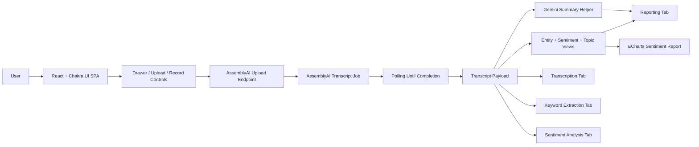

# Swar Guru


## Description

Swar Guru is an AI-powered audio analysis dashboard built with React and Vite.
It lets users record audio or upload an audio file, sends the audio to
AssemblyAI for transcription and enrichment, then presents the output through
sentiment analysis, entity highlighting, topic detection, summaries, and visual
reports.

## Overview

The application is a single-page interface centered around a left-side action
drawer and a tabbed results area. Users can start a recording session or upload
an audio file, and once processing completes the app reveals the generated
transcript alongside multiple analysis views.

### Key capabilities

- Record audio directly in the browser.
- Upload an existing audio file.
- Transcribe audio through AssemblyAI.
- Extract sentiment, entities, and IAB categories.
- Generate an AI summary with Google Gemini.
- Visualize sentiment distribution with ECharts.
- Present analysis in a Chakra UI-based dashboard.

## Architecture



## Tech Stack

| Area                  | Tools                         |
| --------------------- | ----------------------------- |
| Frontend framework    | React 18                      |
| Build tool            | Vite                          |
| UI system             | Chakra UI                     |
| Animations            | Framer Motion                 |
| Audio capture         | react-voice-recorder          |
| Transcription service | AssemblyAI                    |
| Summary generation    | Google Generative AI (Gemini) |
| Charts                | ECharts                       |
| Linting               | ESLint                        |

## Features in the Current Build

- **Transcription Engine** shows the completed transcript payload after
  processing.
- **Keyword Extraction** highlights unique entities and labels them by entity
  type.
- **Sentiment Analysis** groups transcript segments into positive, neutral, and
  negative buckets.
- **Reporting and Visualization** generates a concise AI summary and a sentiment
  chart.
- **Audio Drawer** handles recording, file selection, upload, reset, and
  modal-based recording controls.

## How It Works

1. The user records audio or selects a local audio file.
2. The app uploads the audio to AssemblyAI.
3. AssemblyAI returns a transcript job id.
4. The app polls the job until transcription completes.
5. The completed payload is rendered across the analysis tabs.
6. Gemini generates a short summary from the transcript text.
7. ECharts renders a sentiment distribution chart for the report view.

## Project Structure

```text
src/
	App.jsx                 # Application shell and transcript workflow
	Components/             # Reusable presentation components
		Chart.jsx             # Sentiment visualization
		DrawerBox.jsx         # Audio recording and upload drawer
		Entity.jsx            # Entity tag renderer
		Summary.jsx           # AI summary display
	Services/               # Feature panels and analysis tabs
		Results.jsx           # Transcript highlighting view
		Keyword.jsx           # Entity and topic extraction view
		SentimentalAnalysis.jsx
		Reports.jsx           # Summary + chart report view
		Status.jsx            # Loading / state indicator
		Topic.jsx             # Topic tag rendering
	helper/
		Symmary.js            # Gemini summary helper
```

## Getting Started

### Prerequisites

- Node.js 18 or newer
- npm
- AssemblyAI API key
- Google Gemini API key

### Installation

```bash
npm install
```

### Configuration

The current implementation uses placeholder API key strings in the source.
Replace them with your own keys before running the app:

- AssemblyAI key for upload and transcript generation
- Gemini key for summary generation

For production use, move those secrets into environment variables and read them
at runtime instead of hardcoding them.

### Run Locally

```bash
npm run dev
```

Then open the local Vite URL shown in the terminal.

## Available Scripts

| Script            | Description                          |
| ----------------- | ------------------------------------ |
| `npm run dev`     | Start the Vite development server    |
| `npm run build`   | Produce a production build           |
| `npm run lint`    | Run ESLint across the project        |
| `npm run preview` | Preview the production build locally |

## Notes

- The app currently operates as a client-side dashboard with direct API calls to
  third-party services.
- The transcript polling loop waits until AssemblyAI marks the job as completed
  or failed.
- Some file names in the repository are currently misspelled, such as
  `Symmary.js`; the README keeps the documented structure aligned with the
  existing codebase.
- If you add a backend later, this README can be extended with deployment, API
  contracts, and authentication details.

## License

No license file is currently included in the repository.
